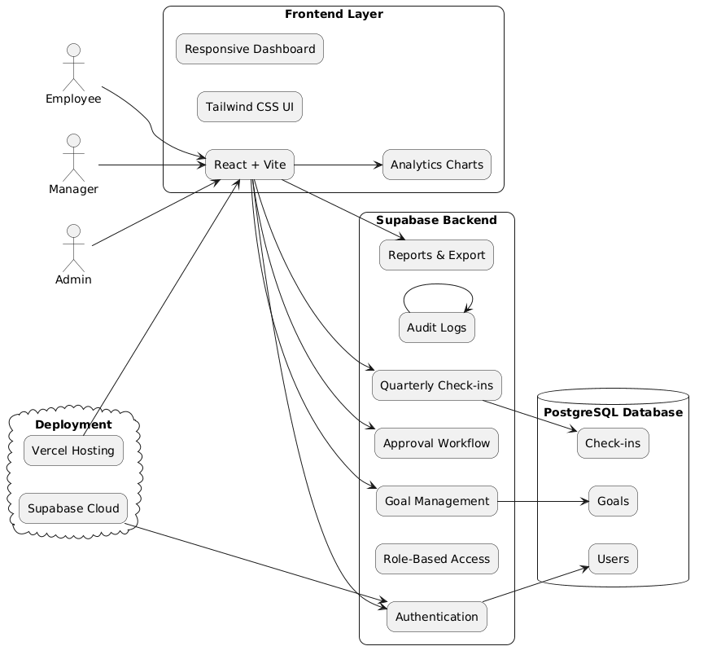

# GoalSync Pro

An enterprise-grade Goal Setting & Performance Tracking Portal for employees, managers, and HR teams.

## Project Overview

GoalSync Pro is a modern web-based performance management platform designed to streamline organizational goal setting, approval workflows, quarterly check-ins, and achievement tracking.

The platform replaces fragmented spreadsheet-based systems with a centralized, real-time, and audit-ready portal that improves transparency, accountability, and performance visibility across the organization.

## Key Features

- Role-based authentication
- Employee goal creation
- Goal approval workflow
- Goal locking system
- Quarterly achievement tracking
- Progress calculation engine
- Shared goals management
- Admin analytics dashboard
- Audit trail logging
- Escalation Engine (Automated notifications)
- CSV/Excel export reports
- Responsive enterprise UI with Dark Mode

## User Roles

### Employee
- Create and submit goals
- Update quarterly achievements
- Track goal progress
- View shared goals

### Manager
- Review and approve goals
- Monitor team performance and check-ins
- Push shared goals to team members

### Admin / HR
- Manage organization-wide cycles
- Unlock goal sheets
- Access analytics and audit logs
- Run Escalation Engine scans

## Tech Stack

### Frontend
- React
- Vite
- Tailwind CSS
- Lucide React (Icons)
- Recharts

### Backend & Database
- Supabase
- PostgreSQL

### Deployment
- Vercel

## System Architecture




## Core Database Tables

- users
- goals
- shared_goals
- checkins
- audit_logs
- notifications

## Validation Rules

- Maximum 8 goals per employee
- Minimum 10% weightage per goal
- Total goal weightage must equal exactly 100%
- Approved goals become locked

## Installation

1. Clone the repository

```bash
git clone https://github.com/Rohitdesu/atom-quest-Hackathon.git
```

2. Install dependencies

```bash
npm install
```

3. Configure environment variables (create a `.env` file)

```env
VITE_SUPABASE_URL=your_supabase_url
VITE_SUPABASE_ANON_KEY=your_supabase_anon_key
```

4. Start development server

```bash
npm run dev
```

## Demo Credentials

### Admin
Email: admin@goalsync.com
Password: Password123

### Manager
Email: manager@goalsync.com
Password: Password123

### Employee
Email: employee@goalsync.com
Password: Password123

## Screenshots

*(Insert your screenshots here)*
- Login Page
- Employee Dashboard
- Manager Dashboard
- Admin Analytics
- Escalation Engine
- Dark Mode View

## Future Enhancements

- Microsoft Teams integration
- AI goal recommendations
- Advanced analytics engine
- Real-time automated email notifications
- Azure AD integration

## Live Demo

https://atom-quest-hackathon-hg94k0gc0-rohits-projects-486a8f26.vercel.app/login

## Repository

https://github.com/Rohitdesu/atom-quest-Hackathon.git
